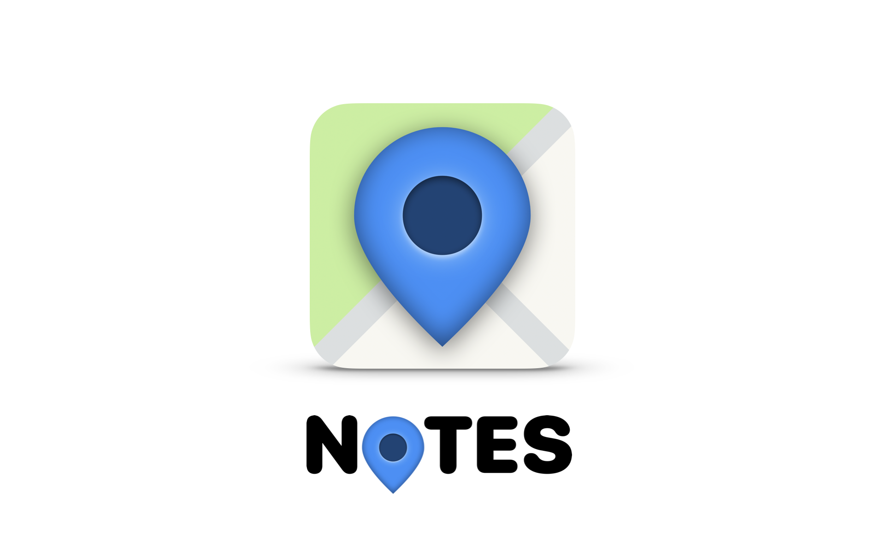
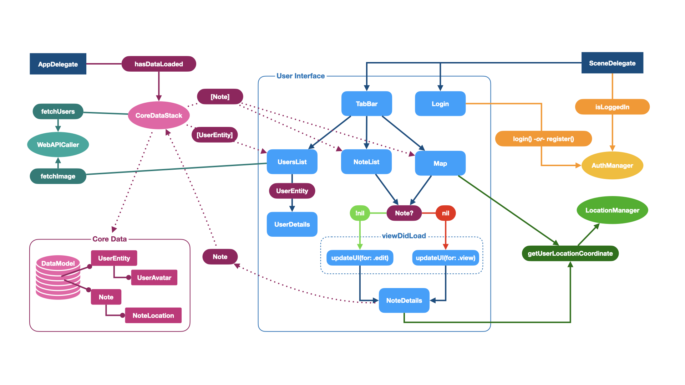
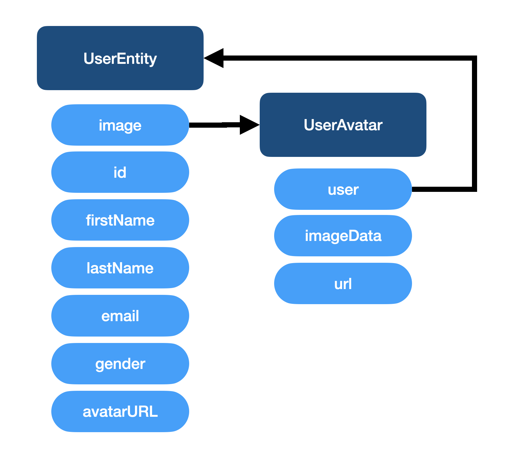
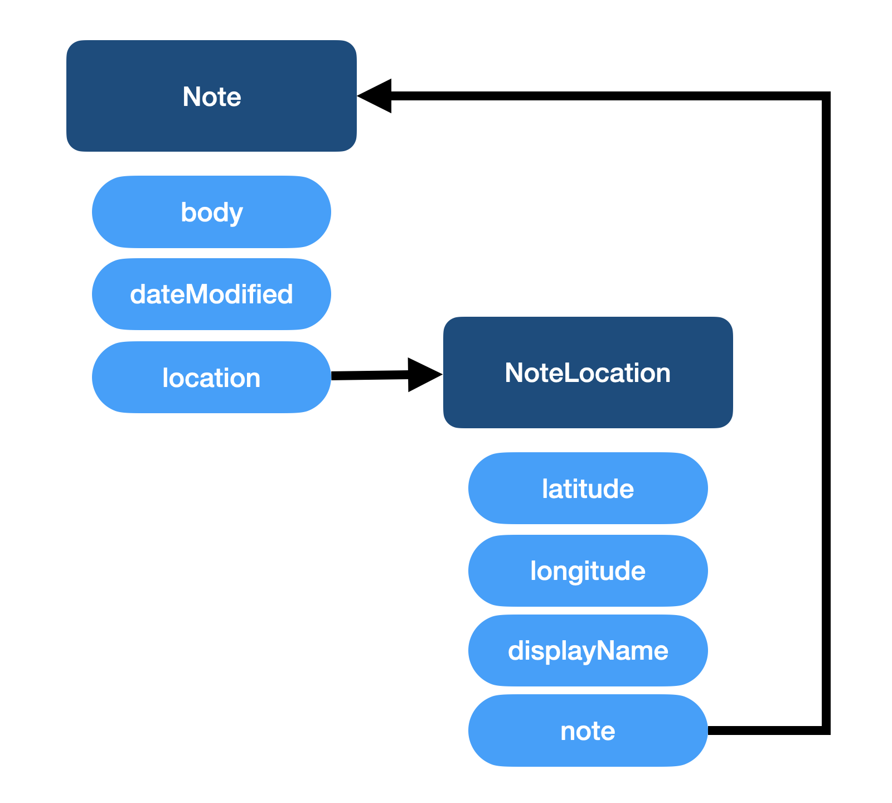
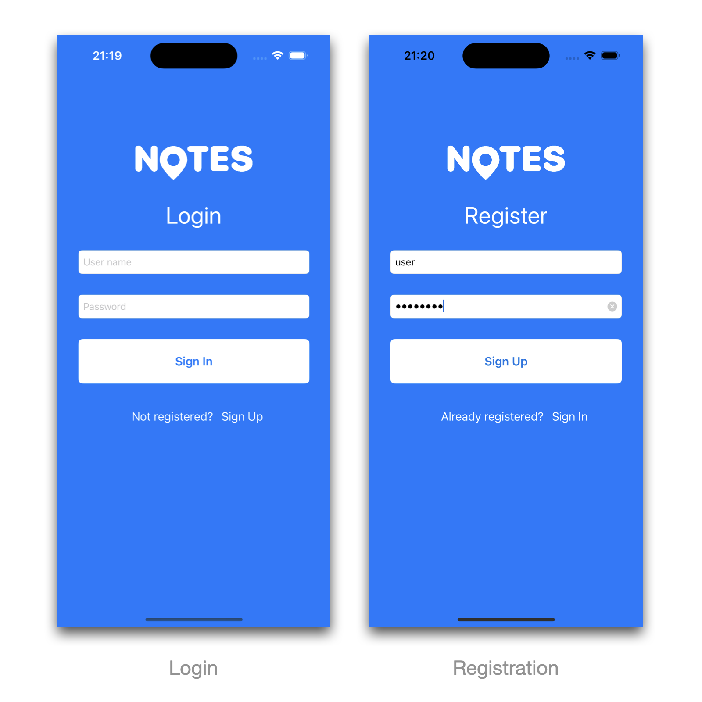
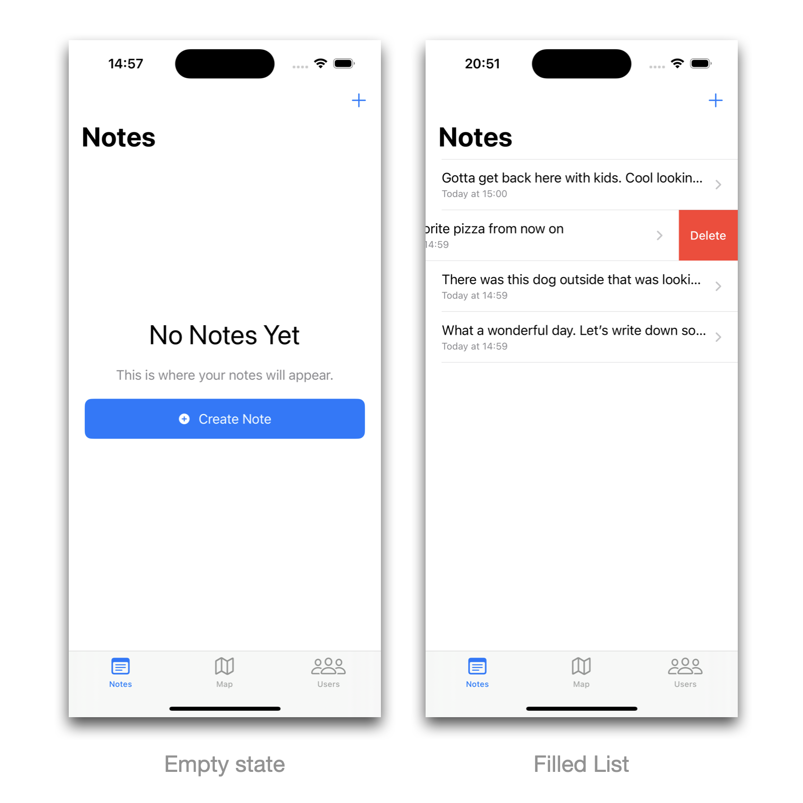
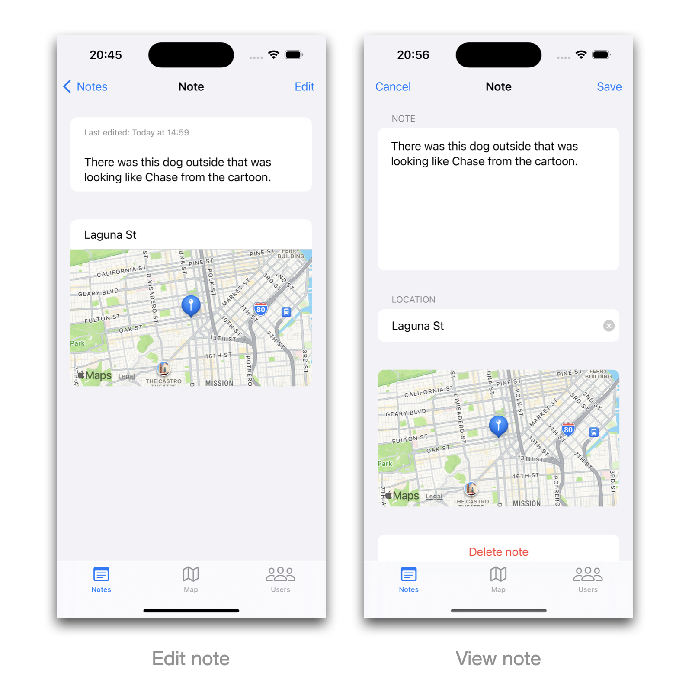
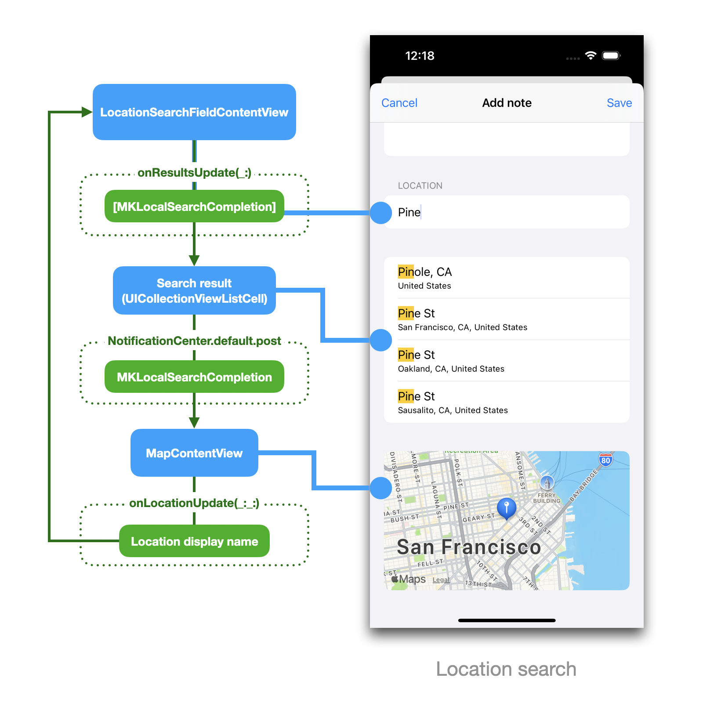
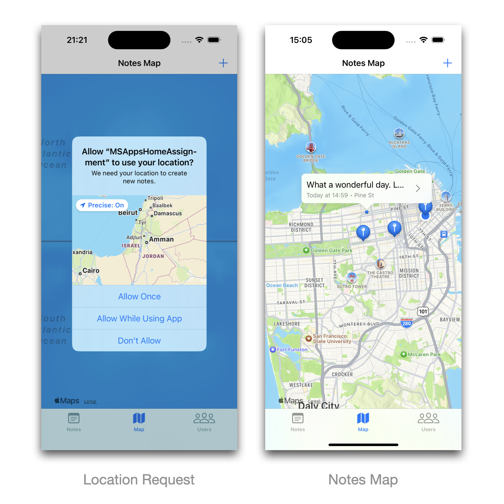
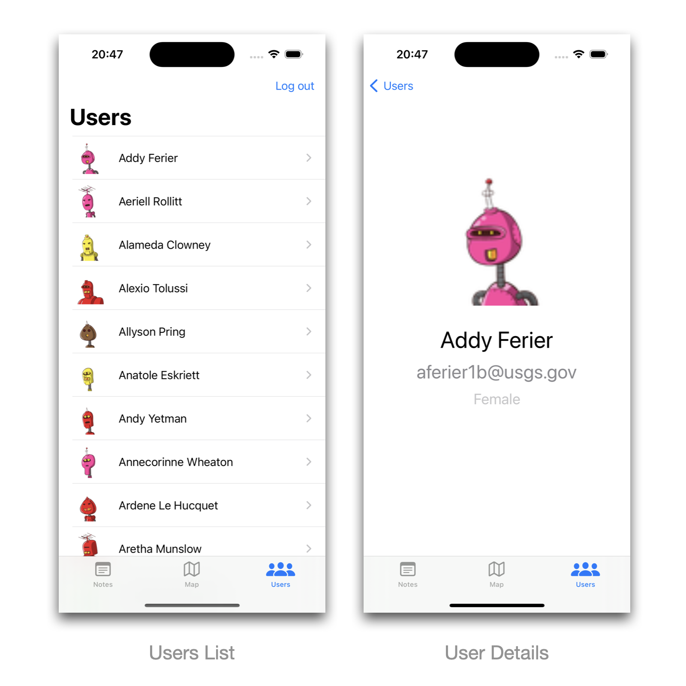

<p align="center">
    
</p>

# Home Assignment Project

Home assignment project for iOS Developer role.

## Task

Create a notes app with ability to view notes on the map, fetch and store data from web API, and basic login.

## Table of contents:

1. [Overview](#overview)
2. [App Structure](#app-structure)
3. [Data Structure](#data-structure)
    - [Users](#users)
    - [Notes](#notes)
4. [User Interface](#user-interface)
    - [Login](#login)
    - [Notes List](#notes-list)
    - [Note Details](#note-details)
    - [Location Search](#location-search)
    - [Notes Map](#notes-map)
    - [Users List & User Details](#users-list-and-user-details)

## Overview

- Interface: **UIKit**
- Layout: **Main.storyboard**
- Persistent storage: **Core Data**
- Login: **UserDefaults**

## App Structure

App navigation is layed out in *Main.storyboard* with behaviors provided by custom view controllers. View controllers fetch data with the help of shared `CoreDataStack` object that handles data in `DataModel` on their behalf. All web API calls are managed by singleton `WebAPICaller` object. `LocationManager` class serves as a single point of access to user location for UI that displays a map. Login and registration logic is defined within `AuthManager`.



## Data Structure

The app relies on Core Data for persistent storage. There are two main entities supported by two related lesser entities: `UserEntity` with `UserAvatar` and `Note` with `NoteLocation`.

### Users

User data is defined as `UserEntity` with `UserAvatar` representing cached data image.



On first app launch the users data is fetched by `WebAPICaller` that decodes JSON into `User` objects, which are then used by `CoreDataStack` to create `UserEntity` for every fetched `User`.

```swift
let users = try await WebAPICaller.shared.fetchUsers()
            
try await persistentContainer.performBackgroundTask { context in
    try users.forEach { user in
        try self.saveUserEntity(for: user, in: context)
    }
}
```

The images for user avatars are fetched as necessary when user scrolls the users list. The images are then cached as `UserAvatar` entities and attached to corresponding `UserEntity`.

```swift
extension UIImageView {
    func loadImage(for user: UserEntity) {
        self.image = UIImage(systemName: "person.fill")
        
        if let avatar = user.image, let imageData = avatar.imageData, let image = UIImage(data: imageData) {
            self.image = image
        } else {
            Task(priority: .high) {
                do {
                    let data = try await WebAPICaller.shared.fetchImage(for: user)
                    self.image = UIImage(data: data)
                    try CoreDataStack.shared.saveUserAvatar(for: user, data: data)
                } catch {
                    print(error.localizedDescription)
                }
            }
        }
    }
}
```

### Notes

Note data is described as `Note` entity with `NoteLocation` entity defining the location of the note on map. 



`Note` entities are created by the user in `NoteDetailsController` view controller on save action. `NoteLocation` entities are created automatically during `Note` creation.

```swift
func createNote(withText body: String, at coordinates: CLLocationCoordinate2D, locationName: String, date: Date) throws {
    let context = viewContext
    
    let location = NoteLocation(context: context)
    location.latitude = coordinates.latitude
    location.longitude = coordinates.longitude
    location.displayName = locationName
    
    let note = Note(context: context)
    note.body = body
    note.dateModified = date
    note.location = location
    
    location.note = note
    
    do {
        try context.save()
    } catch {
        throw CoreDataError(kind: .noteSave, note: note)
    }
}
```

## User Interface

The app's navigation is layed out in *Main.storyboard* with custom view controllers providing behaviors.

### Login
#### `LoginViewController`



Login and registration UI is managed by `LoginViewController` that uses `AuthManager` to model authentication logic. For simplicity, this home assignment project uses `UserDefaults` to store registered user credantials.

The `SceneDelegate` determines whether to show the login screen on app launch.

```swift
func scene(_ scene: UIScene, willConnectTo session: UISceneSession, options connectionOptions: UIScene.ConnectionOptions) {
    guard let _ = (scene as? UIWindowScene) else { return }
        
    if AuthManager.isLoggedIn {
        window?.rootViewController = .getViewController(withIdentifier: .main)
    } else {
        window?.rootViewController = .getViewController(withIdentifier: .login)
    }
}
```

### Notes List
#### `NotesListController`



Because notes are a dynamic user-generated data they’re displayed using `UITableViewController` with `UITableViewDiffableDataSource` for dynamic list updates. Empty state is shown when notes list is empty.

`NotesListController` view controller serves as a `NoteDetailsDelegate` delegate for `NoteDetailsController` in order to update notes list if a new note was created or an existing note was deleted from note details screen.

```swift
extension NotesListController: NoteDetailsDelegate {
    func didUpdateNote() {
        updateNotesList()
        checkIfNotesExist()
    }
}
```

### Note Details
#### `NoteDetailsController`



Note details screen is implemented as `UICollectionViewController` and utilizes `UICollectionViewDiffableDataSource` for dynamic switching between note editing and viewing modes, and for location search results fetching during editing.

```swift
func updateUI(for updateCase: UpdateCase, animated: Bool = true) {
    updateNavigationBar(for: updateCase)
    switch updateCase {
    case .view:
        isEditing = false
        updateSnapshotForViewing(animated: animated)
    case .edit:
        isEditing = true
        updateSnapshotForEditing(animated: animated)
    case .searchResults(let results):
        updateSnapshotWithSearchResults(results, animated: animated)
    }
}
```

Most cells are defined as custom views using `UIContentView` protocol. Some custom cells accept completion handlers during cell configuration, which are used by `NoteDetailsController` to communicate between cells.

```swift
func mapConfiguration(cell: UICollectionViewListCell) {
    var content = cell.mapConfiguration()
    content.location = note?.location
    content.onLocationUpdate = { coordinate, locationName in
        self.newLocation = coordinate
        self.newLocationName = locationName
    }
    cell.contentConfiguration = content
}
```

When a note is saved or deleted, `NoteDetailsController` calls `didUpdateNote()` method on its `NoteDetailsDelegate`, that depends on which view controller has presented the `NoteDetailsController`.

```swift
CoreDataStack.shared.saveViewContext()
delegate?.didUpdateNote()
updateUI(for: .view)
```

### Location Search
#### `LocationSearchFieldContentView`

During location search custom cells in `NoteDetailsController` communicate with each other through combination of completion handlers defined during cell registration and publishing notifications to `NotificationCenter`.



As user types in text field in `LocationSearchFieldContentView`, it sends `MKLocalSearchCompletion` to `NoteDetailsController` which is then used to update UI with location search results.

```swift
// MARK: - UITextFieldDelegate

extension LocationSearchFieldContentView: UITextFieldDelegate {
    func textField(_ textField: UITextField, shouldChangeCharactersIn range: NSRange, replacementString string: String) -> Bool {
        if let text = textField.text {
            searchCompleter.queryFragment = text
        }
        return true
    }
}

// MARK: - MKLocalSearchCompleterDelegate

extension LocationSearchFieldContentView: MKLocalSearchCompleterDelegate {
    func completerDidUpdateResults(_ completer: MKLocalSearchCompleter) {
        guard let configuration = configuration as? Configuration else { return }
        configuration.onResultsUpdate(completer.results)
    }
}
```

Tap on a location result updates the map with new coordinate and location search field with completed text through NotificationCenter.

```swift
override func collectionView(_ collectionView: UICollectionView, didSelectItemAt indexPath: IndexPath) {
    let row = dataSource.itemIdentifier(for: indexPath)
    
    if case .editLocationResult(let searchCompletion) = row {
        NotificationCenter.default.post(name: .didTapSearchResult, object: nil, userInfo: [NSNotification.searchCompletionKey: searchCompletion])
        updateUI(for: .searchResults([]), animated: true)
    }
}
```

### Notes Map
#### `MapViewController`



Notes are represented on the map as pin annotations, with callouts containing basic note information. 

Notes fetched during the `viewWillAppear()` call on `MapViewController` and are stored in a dictionary paired with `MKPointAnnotation` to be retrieved during `mapView(_:viewFor annotation:)` call. 

```swift
var noteAnnotations: [Note: MKPointAnnotation] = [:]

override func viewWillAppear(_ animated: Bool) {
    fetchNotes()
    updateAnnotations()
    setDefaultCenterPoint()
}

func mapView(_ mapView: MKMapView, viewFor annotation: any MKAnnotation) -> MKAnnotationView? {
    guard 
        let pointAnnotation = annotation as? MKPointAnnotation,
        let note: Note = noteAnnotations.first(where: { $0.value == pointAnnotation })?.key,
        let noteText: String = note.body
    else { return nil }
    // Define annotation view for notes...
}
```

Default map center is set to the location of the latest note, or to the user location if there are no notes. If user location is not available the center is set to zero coordinate. Updates to user location are managed through `LocationManager` shared object.

Similarly to `NotesListController`, the `MapViewController` view controller serves as a `NoteDetailsDelegate` delegate for `NoteDetailsController` in order to update the map if a new note was created or an existing note was deleted from note details screen.

### Users list and User Details
#### `UsersListViewController` & `UserDetailsViewController`



Users list screen is implemented as a simple `UITableViewController`. Since users data is not expected to be changed after it was fetched from web API, it can be fetched from data using `NSFetchedResultsController` and there's no need for diffable data source usage here. 

Log out button in the list’s navigation bar allows users to log out.
